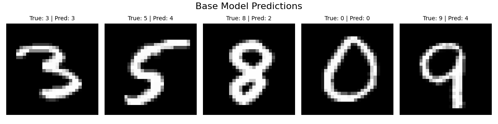
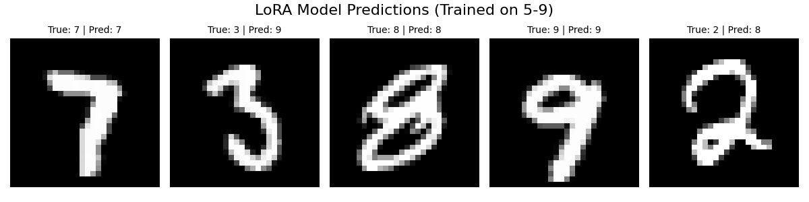
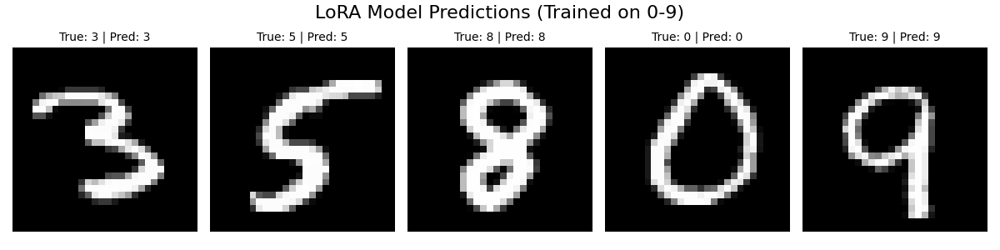

# LoRA MNIST Finetuning

This project demonstrates the use of LoRA (Low-Rank Adaptation) for fine-tuning a model on the MNIST dataset using PyTorch Lightning. Initially, the plan was to train the model on digits `0-4` and then fine-tune it on digits 5-9 using LoRA. However, this approach resulted in poor generalization between the two digit sets. To overcome this, LoRA was re-applied using the full MNIST dataset (0-9) for fine-tuning, restoring the model's performance across all digits. The project incorporates custom data handling, training, visualization, and evaluation.

---

## Table of Contents
1. [Setup Instructions](#setup-instructions)
2. [Project Structure](#project-structure)
3. [Key Features](#key-features)
4. [Results](#results)
5. [License](#license)

---

## Setup Instructions

### 1. Clone the Repository

```bash
git clone https://github.com/NightFore/LoRA_MNIST_Finetuning.git
cd LoRA_MNIST_Finetuning
```

### 2. Install Dependencies

```bash
pip install -r requirements.txt
```

### 3. Fine-tune the Model

Run the Jupyter notebook `LoRA_MNIST_Finetuning.ipynb`.

```bash
jupyter notebook LoRA_MNIST_Finetuning.ipynb
```

---

## Project Structure

```
LoRA_MNIST_Finetuning/
│
├── LoRA_MNIST_Finetuning.ipynb             # Jupyter notebook for training and fine-tuning with LoRA
├── data/                                   # Root directory for all data-related files
│   ├── MNIST/                              # Automatically downloaded MNIST dataset
│   ├── logs/                               # Training logs
│   └── checkpoints/                        # Saved model checkpoints
├── output/                                 # Directory for saving results
├── requirements.txt                        # Project dependencies
```

---

## Key Features

### 1. **Custom Dataset and DataModule**
- **`MNISTDataset`**: Custom class for filtering specific digits and applying transformations.
- **`MNISTDataModule`**: PyTorch Lightning DataModule for handling train, validation, and test datasets.

### 2. **MNIST Model**
- **`MNISTModel`**: Simple fully connected neural network for classification.

### 3. **Fine-Tuning with LoRA**
- **Base model**: Initially trained on digits `0-4` to serve as the foundation for LoRA-based fine-tuning.
- **LoRA fine-tuning**: Fine-tuning performed on digits `5-9` after the base model was trained, initially revealing overfitting issues.
- **Final adjustment**: Re-trained using the entire MNIST dataset (`0-9`) to restore the performance across both subsets.

---

## Results

### **Base Model Performance** (Trained on 0-4)

The base model, trained on digits `0-4`, achieves a high **99% accuracy** on the same digits:

| Test Metric    | Value         |
|----------------|---------------|
| Test Accuracy  | 99.09%        |
| Test Loss      | 0.039         |

As expected, the model struggles with digits `5-9` (not included in training), resulting in **0% accuracy**:

| Test Metric    | Value         |
|----------------|---------------|
| Test Accuracy  | 0.00%         |
| Test Loss      | 15.50         |



### **Fine-Tuning with LoRA** (Rank Experiment)

LoRA fine-tuning improved performance on digits `5-9`. The results for various LoRA ranks are as follows:

| LoRA Rank | Test Accuracy  |
|-----------|----------------|
| 1         | 83.81%         |
| 2         | 93.31%         |
| 4         | 95.47%         |
| 8         | 96.96%         |
| 16        | 97.59%         |
| 32        | 97.65%         |
| 64        | 97.96%         |

After fine-tuning, the model reached a **97.37% accuracy** on digits `5-9` with rank `32`.

### **Limitations and Observations**

While LoRA fine-tuning excelled at improving performance on digits `5-9`, it completely failed to recognize digits `0-4`. This overfitting suggests that, during LoRA fine-tuning on `5-9`, the model "forgot" its ability to generalize to the first digit set. Testing with `lora_alpha = 0` verified that without LoRA, the base model used could still recognize `0-4`.



### **Final LoRA Training on Full Dataset (0-9)**

To resolve the issue, LoRA was applied again, but this time using the entire MNIST dataset (`0-9`) to fine-tune the base model.

| LoRA Rank | Test Accuracy  |
|-----------|----------------|
| 64        | 97.14%         |



This approach restored balanced performance across both sets, ensuring accuracy on digits `0-4` and `5-9` without degradation.

## License

This project is licensed under the MIT License - see the [LICENSE](LICENSE) file for details.